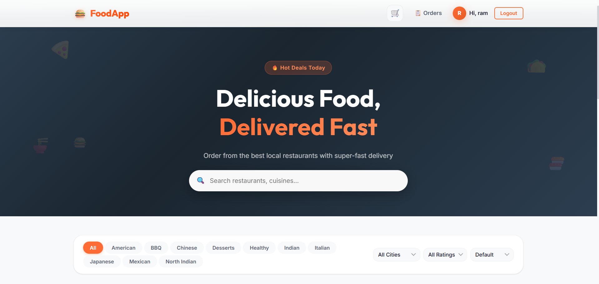
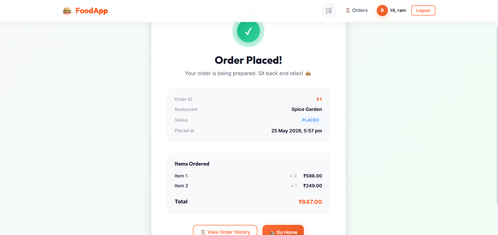
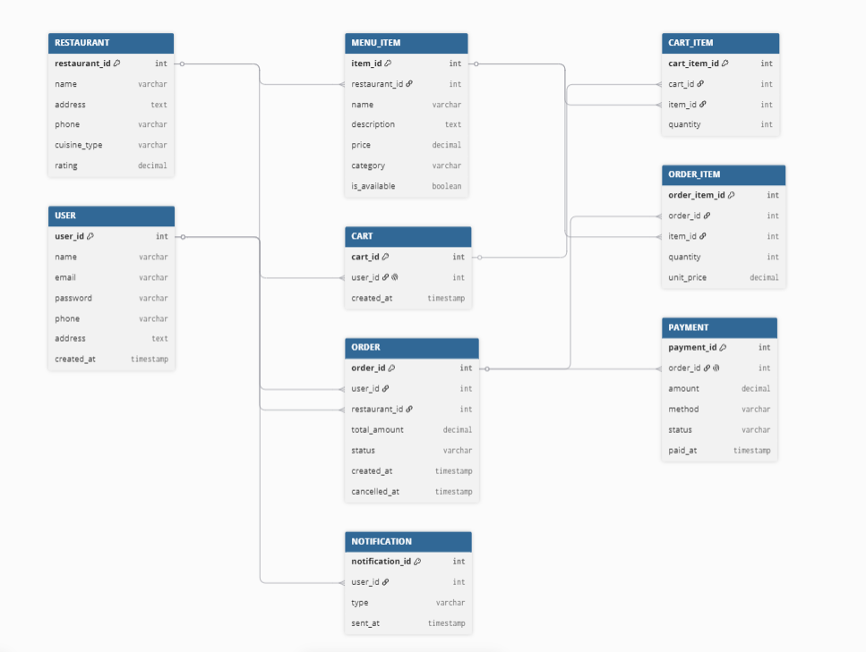

# 🍔 Food Delivery App

A full-stack, feature-rich food delivery application built with **React (Frontend)** and **Spring Boot (Backend)**. This platform allows users to browse restaurants by location and cuisine, add items to their cart, place orders, and receive real-time email notifications regarding their order status.

## 🚀 Tech Stack

### Frontend (User Interface)
- **Framework:** React.js (built with Vite)
- **Routing:** React Router DOM
- **HTTP Client:** Axios (with interceptors for JWT)
- **Styling:** Custom Vanilla CSS (Modern, responsive, glassmorphism UI)
- **State Management:** React Hooks (`useState`, `useEffect`, `useContext`)

### Backend (Server & API)
- **Framework:** Spring Boot (Java)
- **Database ORM:** Spring Data JPA / Hibernate
- **Database Engine:** MySQL
- **Security:** Spring Security + JWT (Stateless Authentication)
- **Email Service:** JavaMailSender (integrated with Gmail SMTP)
- **Tooling:** Lombok, Maven

---

## ✨ Key Features

### 1. 🔐 Secure Authentication & User Profiles
- **JWT Authentication:** Secure login and registration flows. Passwords are encrypted using `BCrypt`.
- **Profile Data:** Users can store their full name, delivery address, and contact number.
- **Role-based Access:** APIs are secured so that users can only access their own carts and orders (IDOR protection).

### 2. 📧 Real-Time Email Notifications
- Fully integrated with Gmail SMTP using Google App Passwords.
- Sends a beautiful **Welcome Email** upon successful registration.
- Sends **Order Confirmation** emails the moment a cart is checked out.
- Sends **Order Cancellation** emails if a user decides to cancel an active order.

### 3. 🍕 Restaurant & Menu Exploration
- Browse from a dynamically seeded database of **12 premium restaurants** split across locations like *Vijayawada* and *Mangalagiri*.
- **Smart Filtering:** 
  - 📍 Filter by **City** (Dynamically extracted from restaurant addresses)
  - 🍜 Filter by **Cuisine** (Indian, Italian, Chinese, American, etc.)
  - ⭐ Filter by **Minimum Rating**
- **Sorting:** Sort by Rating (High to Low) or Alphabetically (A-Z).
- **Search:** Instant keyword search through restaurant names and cuisines.

### 4. 🛒 Interactive Cart System
- Global cart state preserved during the user's session.
- Add items, adjust quantities (`+` / `-`), or remove items.
- Live calculation of total prices and item counts.

### 5. 📦 Order Management
- **One-Click Checkout:** Places the order and automatically attaches the user's saved delivery address and phone number.
- **Order History Dashboard:** Users can view their past orders, total amounts, timestamps, and the delivery details used.
- **Order Cancellations:** Users can cancel an order as long as its status is still "PLACED".

---

## 🛡️ Security Measures
- **Stateless Sessions:** Using JWT ensures no session state is kept on the server, mitigating CSRF attacks.
- **Data Isolation:** `OrderServiceImpl` explicitly checks `order.getUser().getId().equals(userId)` before allowing a user to view or cancel an order. You cannot access another person's data.
- **Database Safety:** Passwords are hashed. Endpoints handling sensitive data require a valid `Authorization: Bearer <token>` header.

---

## 🛠️ Setup & Installation

### Prerequisites
- Java 17+
- Node.js (v16+)
- MySQL Server running locally on port `3306`

### 1. Database Setup
Create a new MySQL database called `food_app`:
```sql
CREATE DATABASE food_app;
```

### 2. Backend Setup
1. Navigate to the backend directory:
   ```bash
   cd Backend
   ```
2. Open `src/main/resources/application.properties` and verify your database credentials and Gmail SMTP App Password:
   ```properties
   spring.datasource.url=jdbc:mysql://localhost:3306/food_app
   spring.datasource.username=root
   spring.datasource.password=your_mysql_password
   
   spring.mail.username=your_email@gmail.com
   spring.mail.password=your_app_password
   ```
3. Run the Spring Boot application:
   ```bash
   mvn spring-boot:run
   ```
   *(Note: On the first run, the `DataSeeder` will automatically populate the database with a test user and 12 restaurants with their menus).*

### 3. Frontend Setup
1. Navigate to the frontend directory:
   ```bash
   cd frontend
   ```
2. Install dependencies:
   ```bash
   npm install
   ```
3. Start the Vite development server:
   ```bash
   npm run dev
   ```
4. Open your browser and navigate to `http://localhost:5173`.

---

## 👨‍💻 Test Account
A test user is automatically created when the backend boots up for the first time:
- **Email:** `test@food.com`
- **Password:** `Test@123`

*(You can also register a brand new account with your real email to test the Welcome and Order emails!)*

---

## 📸 Screenshots

### Home Page


### Order Placed


### Database Schema / View

